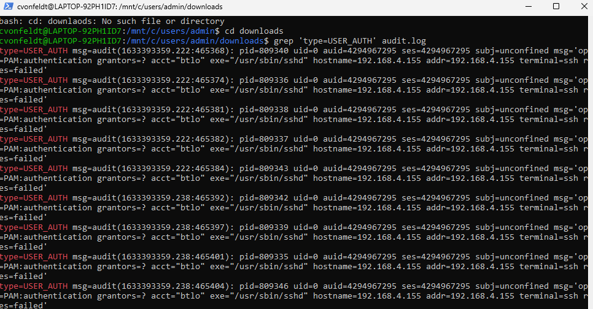
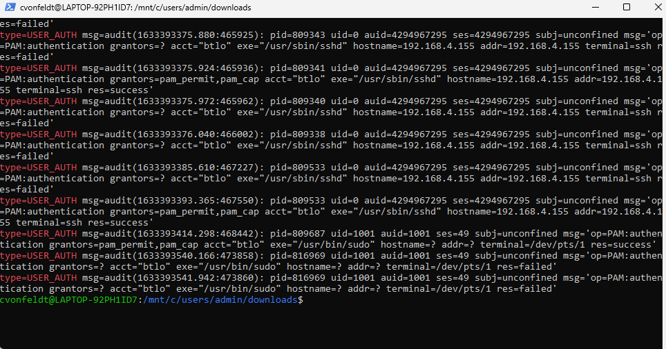
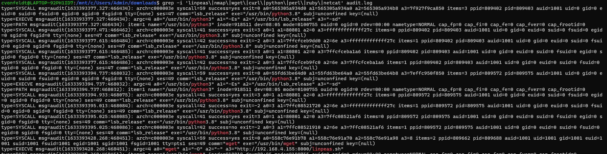
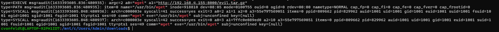
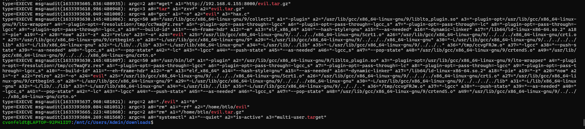
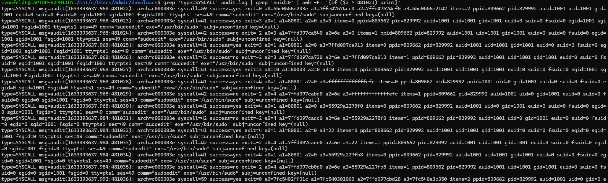
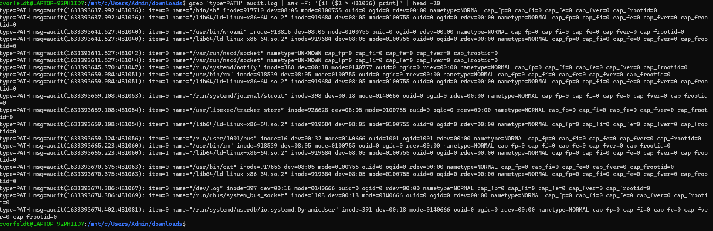
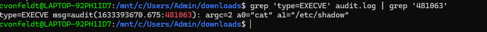

# Overview: 
**We are provided with Linux audit logs from a compromised endpoint, and we need to analyze the logs to answer the prompt questions to ultimately find out the steps and techniques used by the attacker.**

<br> 


**This is another challenge where we are tasked with manually sifting through the log file without any sort of SIEM or logging aggregate tool, so this time we will use bash to analyze the logs.**

<br>

## Investigation:

### 1. What account was compromised?

For this one we know it's an account being compromised and not a device, so my first thought is to check for attempted logins: 


We can see many successive failed attempts separated by seconds/milliseconds almost certainly indicating a brute force attack over SSH, then we finally see a successful attempt with a timestamp of 1633393393.365:467550 (October 4th 2021):


We see here the account compromised is "btlo".


**Answer: btlo**

---


### 2. What attack type was used to gain initial access?
We see from above that the attack is brute force over SSH!

**Answer: Brute Force**

---

### 3. What is the attacker's IP address?
We see in the successful login log that the attacker's IP is 192.168.4.155!

**Answer: 192.168.4.155**

---

### 4. What tool was used to perform system enumeration?
For this I'm going to search for command line execution that inlcudes common enumeration tools (netcat, linpeas, nmap, etc.): 

```bash
grep -i 'linpeas\|nmap\|wget\|curl\|python\|perl\|ruby\|netcat' audit.log:
```



We can see in Event 468451 that linpeas is downloaded, and we can see in Event 468664 (and events after) linpeas being run and scanning different directories in the system.
**Answer: linpeas**

---

### 5. What is the name of the binary and pid used to gain root?
For this we see that a gzip file called evil.tar.gz was downloaded from the same IP (attacker IP) that linpeas was downloaded from:


We will look more into that with the command:

```bash
grep 'type=EXECVE' audit.log | grep 'evil\|tar'
```


We see a binary called "evil" being compiled with collect2 and ld (C code compiler tools), so let's check related SYSCALL logs after evil was created where euid == 0 (means user ID is root): 


In the very next event (ID = 481022) we see a successful "sudoedit" with euid = 0 and pid=829992, meaning evil found a vulnerability within sudoedit that allowed for root privilege escalation. 
**Answer: evil, 829992**

---

### 6. What CVE was exploited to gain root access? (Do your research!) 
The CVE exploited was CVE-2021-3156 (nicknamed "Baron Samedit") - which is a heap buffer overflow in sudo triggered by sudoedit that allows for root access and affects any local user regardless of sudo privileges. 
**Answer: CVE-2021-3156**

---

### 7. What type of vulnerability is this? 
*Answered above*

**Answer: Heap-Based Buffer Overflow**

---

### 8. What file was exfiltrated once root was gained? 
For this one we are going to filter for PATH logs after root access was gained to check where files were catted, opened/read, etc:

```bash
grep 'type=PATH' audit.log | awk -F: '{if ($2 > 481036) print}' | head -20
```



We see event 481063 is catting a file, but it doesn't say what that file is, so we will need to check the EXECVE log for that event: 

```bash
grep 'type=EXECVE' audit.log | grep '481063'
```



We can see here the file catted is "/etc/shadow" which holds all of the hashed passwords only accessible by root - this is the file that was exfiltrated!

**Answer: /etc/shadow**

---

**Completed:**

