# Overview: 
**We are provided with a malicious sample related to the "Follina" vulnerability, and we need to analyze it to answer the prompt questions and understand how this RCE exploit works in the wild.**
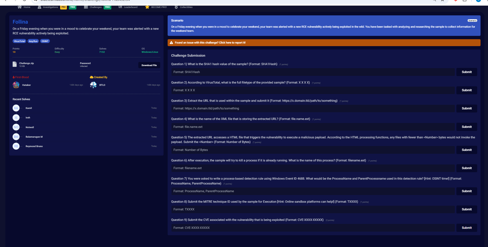

 

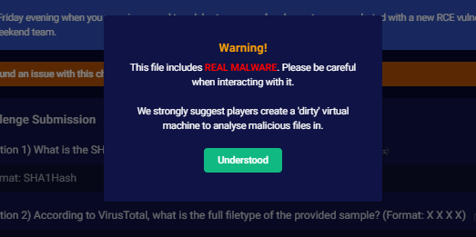

### Methodology: 
**This challenge contains real malware so I won't unzip the file on my host machine - instead I'll use this opportunity to showcase the strength and ability of OSint - VirusTotal, Any.Run, etc. - as an alternative in analyzing malware.**

 

## Investigation:

### 1. What is the SHA1 hash value of the sample?
For safety, I'm just going to have claude ai unzip the file and calculate the sha1 hash value:
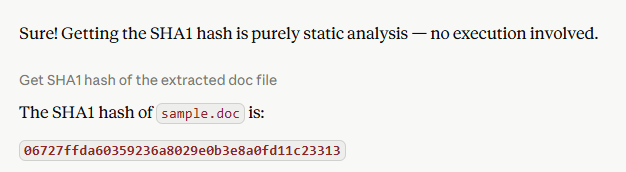

If I were to do it myself, I would simply run sha1sum sample.doc in wsl and get the same value of 06727ffda60359236a8029e0b3e8a0fd11c23313.

**Answer: 06727ffda60359236a8029e0b3e8a0fd11c23313**

---

### 2. According to VirusTotal, what is the full filetype of the provided sample? 
Now that we have the sha1 hash, we can enter that into virustotal and get more info regarding the attack:
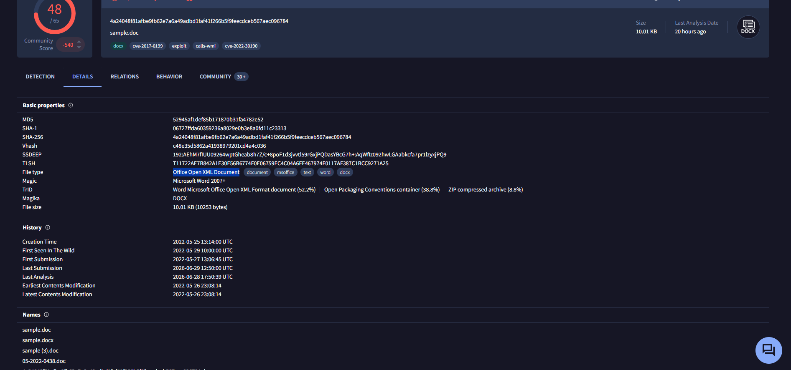

We see it's an Office Open XML Document. 

**Answer: Office Open XML Document**

---

### 3. Extract the URL that is used within the sample and submit it 
In VirusTotal we can see the network communications which we know would need to be used here:
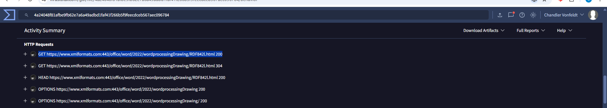

We can see a successful HTTP GET: GET https://www.xmlformats.com:443/office/word/2022/wordprocessingDrawing/RDF842l.html 200, and we can assume that this is where/how the payload is downloaded.

**Answer: https://www.xmlformats.com:443/office/word/2022/wordprocessingDrawing/RDF842l.html**

---

### 4. What is the name of the XML file that is storing the extracted URL? 
Of the bundled xml files:
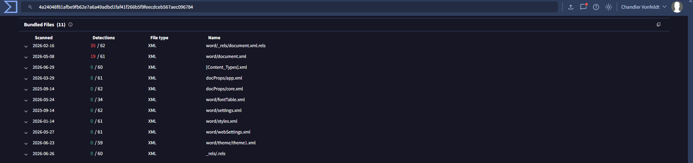

We can see there are only 2 with antivirus engine warnings, and we know that .rels (relations) files contain URLs, so we can assume this is the XML that stores the malicious URL.

**Answer: word/_rels/document.xml.rels**

---

### 5. The extracted URL accesses a HTML file that triggers the vulnerability to execute a malicious payload. According to the HTML processing functions, any files with fewer than <Number> bytes would not invoke the payload. Submit the <Number>

For this one I first attempted to use any.run browser, but couldn't get past the CAPTCHA:
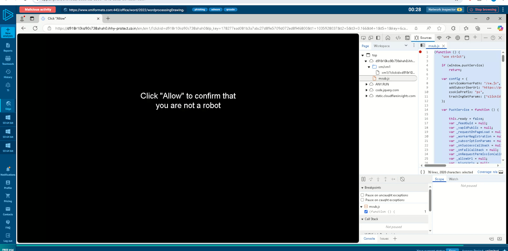

So I knew I needed to use other OSint. I went to Huntress.com - a trusted and well-known MSP - and saw they had documentation regarding the Follina attack:
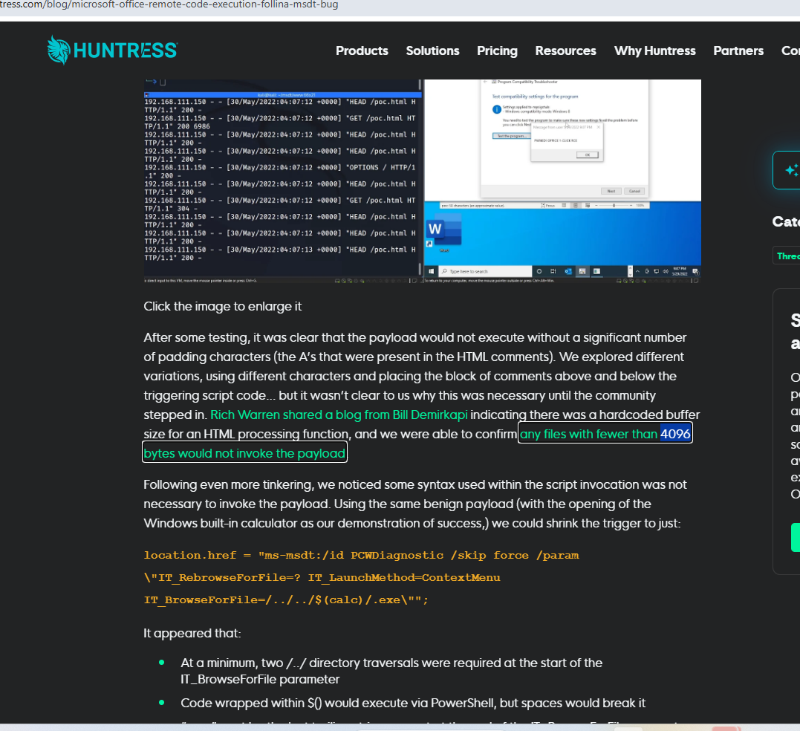

In their documentation they noted that they found the byte threshold was 4096 - meaning the attack staged on the html at that time needed to be at least 4096 bytes to invoke the payload.

**Answer: 4096**

---

### 6. After execution, the sample will try to kill a process if it is already running. What is the name of this process? 
I tried again to use any.run (but instead just file analysis) for this one to view the process tree, but it didn't include anything about a process being killed:
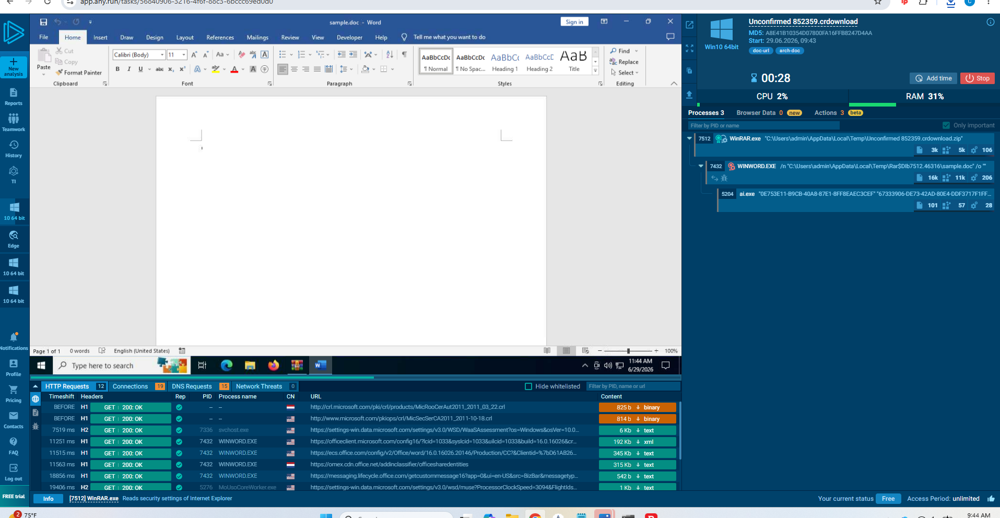
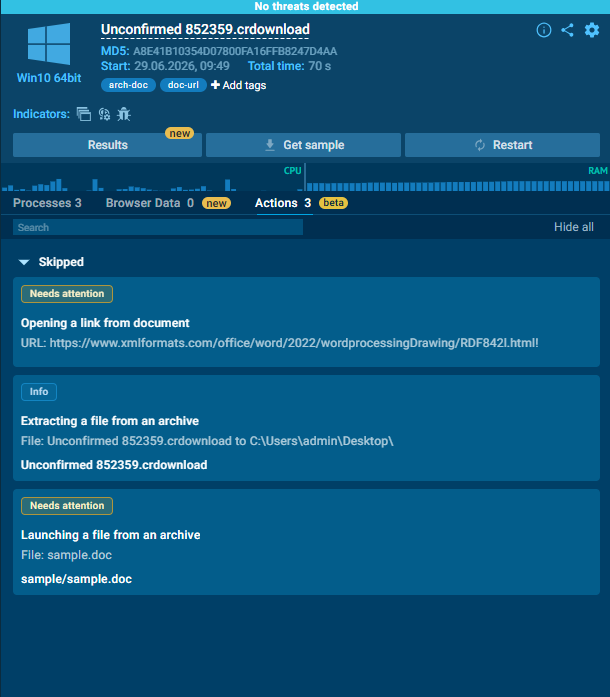

I tried going to the URL directly and it was down (so i'm not really sure why it had me doing CAPTCHA in question 5 - most likely I was redirected):
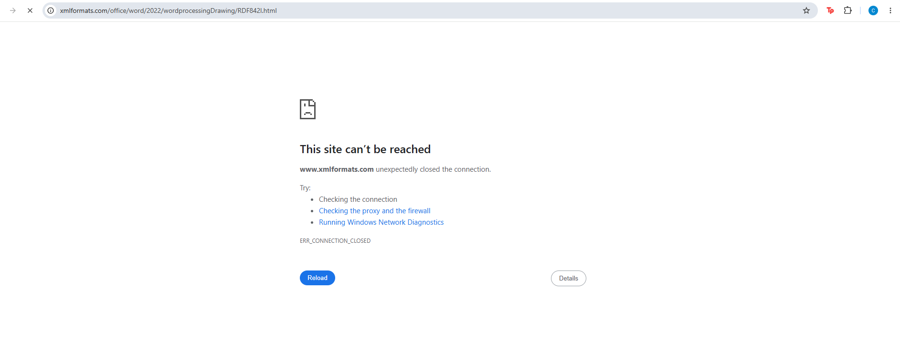

So I went to virustotal again and saw there was a section that listed terminated processes:
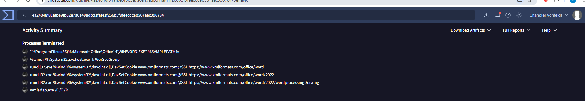

We can see here that WINWORD.exe is temrinated, which makes sense as the attack would likely want to cover its tracks and close word so the user doesn't inspect further (hope they think it just crashed). I thought I could assume that WINWORD.EXE was the process the question is referring to here, but that wasn't the right one apparently. 

Knowing I had to do some more OSint research, I was able to find a direct link to someone's any.run runthrough where the malware ran to completion (mine wouldn't work because the html URL is down now):
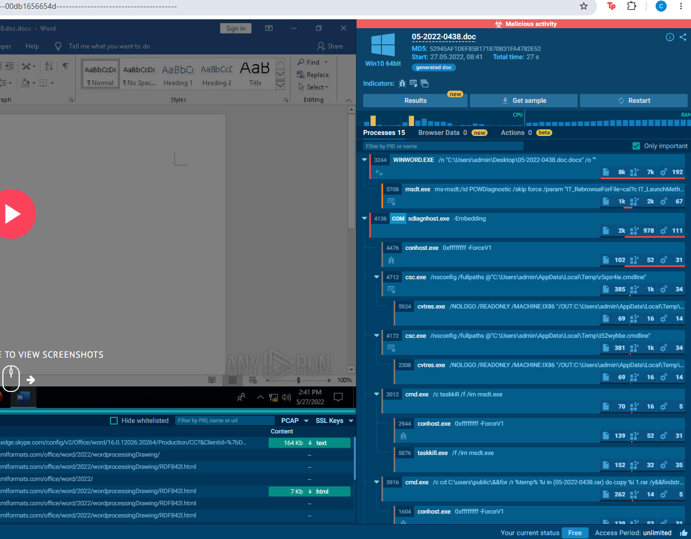

Here we see in the process tree a taskkill of msdt.exe, which makes sense due to the same reasons why WINWORD.EXE is killed - cleanup and removal of evidence of how payload was executed.

**Answer: msdt.exe**

---

### 7. You were asked to write a process-based detection rule using Windows Event ID 4688. What would be the ProcessName and ParentProcessname used in this detection rule? [Hint: OSINT time!] 
For this I would think that any time Word spawns msdt.exe process, that would be a red flag since that shouldn't occur in a healthy environment. It should only occur as a troubleshooting/diagnostic tool and would be spawned from a windows parent process (svchost.exe, explorer.exe, control.exe) not word. If this is wrong I will use OSint, but I think this is right. 

After checking, it is indeed correct!

**Answer: ProcessName: msdt.exe, ParentProcessName: WINWORD.exe**

---

### 8. Submit the MITRE technique ID used by the sample for Execution
I remember seeing MITRE ATTACK mapping of the attack chain in virustotal, so I'll go back to that:
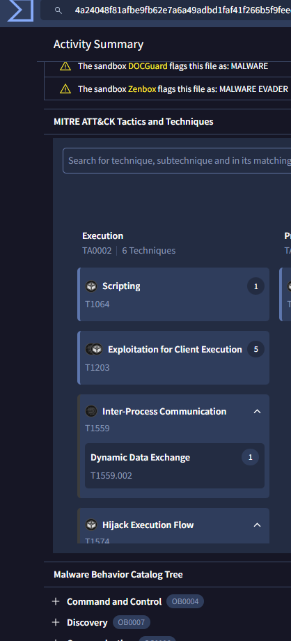

We know from this MITRE list of execution techniques, that Interprocess Communication (Dynamic Data Exchange) is responsible for the sample execution. As mentioned in the answer to question 7, we see interprocess communication with word (process WINWORD.EXE) and Microsoft Support Diagnostic Tool (msdt.exe), as word pulls the URI then which initiates msdt to open and run the stored powershell script (Note: this could also fall under "T1064: Scripting" for the ps script).

**Answer: T1559**

---

### 9.  Submit the CVE associated with the vulnerability that is being exploited
This also sounds like a question for VirusTotal:
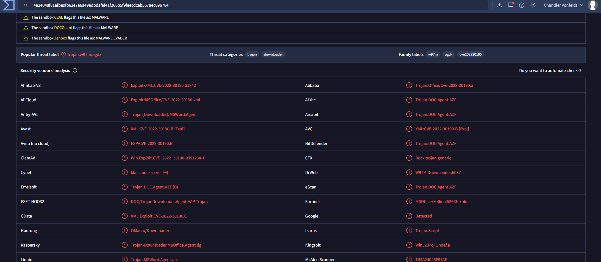

We can see in all of the security vendors' diagnsoses that the associated CVE is 2022-30190.

**Answer: CVE-2022-30190**

---

**Completed:**
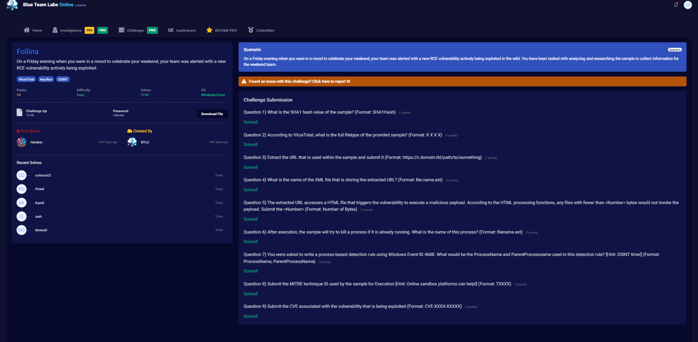
