# Overview: 
**We are provided with Sysmon logs from a compromised endpoint, and we need to analyze the logs to answer the prompt questions to ultimately find out the steps and techniques used by the attacker.**

<br> 

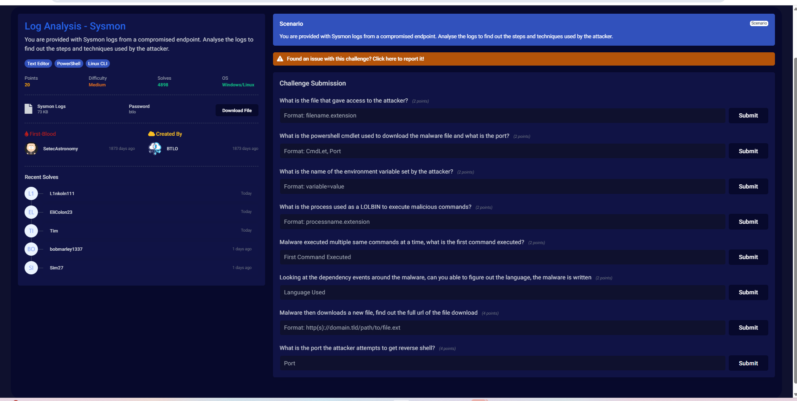

### Methodology: 
**This is a unique challenge because we are tasked with manually sifting through the sysmon log file without any sort of SIEM or logging aggregate tool, so I will instead use powershell to analyze the logs.**

<br>

### Attack Chain: 
                                                          User runs updater.hta
                                                                  ↓
                                                              mshta.exe
                                                                  ↓
                                                          Encoded PowerShell
                                                                  ↓
                                                          Invoke-WebRequest
                                                                  ↓
                                                        Downloads supply.exe
                                                                  ↓
                                                        Sets COMSPEC variable
                                                                  ↓
                                                        Abuses ftp.exe (LOLBIN)
                                                                  ↓
                                                  Runs reconnaissance (ipconfig, whoami)
                                                                  ↓
                                                        Downloads JuicyPotato.exe
                                                                  ↓
                                                        Privilege Escalation
                                                                  ↓
                                                          SYSTEM privileges
                                                                  ↓
                                                           Launches nc.exe
                                                                  ↓
                                                        Reverse shell to attacker
                                                                  ↓
                                                  Attacker gains full interactive access

## Investigation:

### 1. What is the file that gave access to the attacker?

So for this one I'm going to first look for command line execution (Event ID 1) and look for a suspicious parent process or spawning file since I know that's a super common initial access vector. 

First I tried this powershell command to convert the log file into individual events (handy powershell tool), then output important info about the parent and child image: 

```powershell
Get-Content "sysmon-events.json" | ConvertFrom-Json | Where-Object { $_.Event.System.EventID -eq 1 } | Select-Object -ExpandProperty Event | Select-Object -ExpandProperty EventData | Select-Object Image, ParentImage, CommandLine | Format-List
```

That gave me errors since the JSON objects weren't wrapped into proper arrays (needs to have a comma after each event and for all of it to be wrapped in brackets), so I ran this to wrap them into a proper array first, then give us the important info we need: 

```powershell
Get-Content "sysmon-events.json" -Raw | ForEach-Object { $_ -replace '}\s*{', '},{' } | ForEach-Object { "[$_]" } | ConvertFrom-Json | Where-Object { $_.Event.System.EventID -eq 1 } | ForEach-Object { $_.Event.EventData } | Select-Object Image, ParentImage, CommandLine | Format-List
```

So I know the events are in chronological order from the top down so we start at the top, and we don't have to scroll far down the list to see suspicious activity: a powershell instance spawned from mshta.exe with an obviously encoded command used in the commandline. 

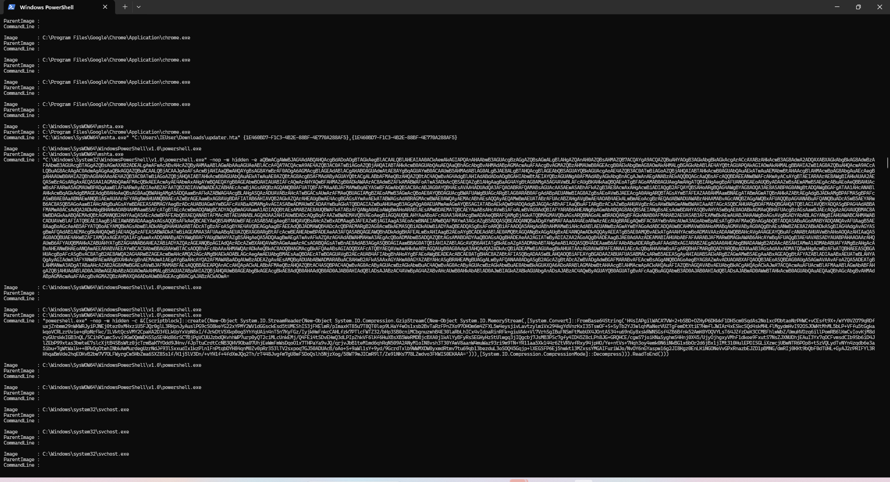

We can see right above it that a file downloaded from chrome called "updater.hta" was run by mshta.exe in the commandline - we can see given what followed that this is the file that initially compromised the machine. 

**Answer: updater.hta**

---


### 2. What is the powershell cmdlet used to download the malware file and what is the port? 

Given that a cmdlet was used and the malware file will most likely be an executable, we will check if this will also have Event ID 1 - so we can just keep scrolling down. Looks like we see it here:

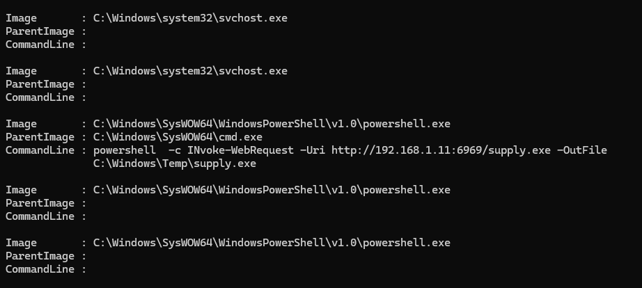

We see the cmdlet is: "INvoke-WebRequest" - which allows interaction with a web page like file downloads, parsing, API interaction, etc. - and the port is 6969. The malware file downloaded appears to be supply.exe. 

**Answer: INvoke-WebRequest, 6969**

---

### 3. What is the name of the environment variable set by the attacker?

So for this we know that a registry change (env variable set) would have Event ID 13, but we might be able to find it with Event ID 1 if the variable was set by the malware as an argument of a cmd.exe creation. 

Scrolling down we find this exactly:

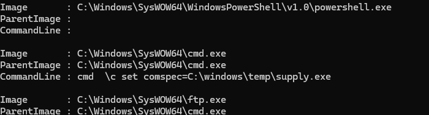

Where we see that the environment variable set is comspec=C:\windows\temp\supply.exe, which makes that folder the default location of command-line execution. We also see that the parent process actually isn't supply.exe, so we can assume that it's likely from the encoded Gzip compression powershell payload that spawned from updater.hta. We will keep that in mind going forward.

**Answer: comspec=C:\windows\temp\supply.exe**

---

### 4. What is the process used as a LOLBIN to execute malicious commands? 

So we know that the living off the land binary is a process used to execute malicious commands, so this should still have Event ID 1. A couple of logs later we see ftp.exe which is a legit process used to transfer files:

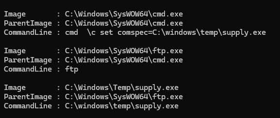

We can see that it's launched from cmd.exe, then launches a process in the location of the new comspec location of C:\windows\temp\supply.exe. This chain precisely fits the LOLBIN process we are looking for, so we know it's ftp.exe.

**Answer: ftp.exe**

---

### 5. Malware executed multiple same commands at a time, what is the first command executed?

So for this one, this still applies: we might be able to find it with Event ID 1 if the variable was set by the malware as an argument of a cmd.exe creation. 

That is indeed the case, as scrolling down we see the same commands of "ipconfig," and "whoami." However knowing that they're simultaneous, that means they'll ahve the same timestamp, so the chronological order of our Sysmon events from top-down won't necessarily apply here. Instead we will need to refine our powershell command to output EventRecordID as well to show which commands really came first:

```powershell
Get-Content "sysmon-events.json" -Raw | ForEach-Object { $_ -replace '}\s*{', '},{' } | ForEach-Object { "[$_]" } | ConvertFrom-Json | Where-Object { $_.Event.System.EventID -eq 1 -and $_.Event.EventData.ParentImage -eq "C:\windows\temp\supply.exe" } | ForEach-Object { [PSCustomObject]@{ RecordID = $_.Event.System.EventRecordID; CommandLine = $_.Event.EventData.CommandLine } } | Sort-Object RecordID | Format-List
```

This should allow us to do what our previous PowerShell command did, but this time return only events with a parent image of C:\windows\temp\supply.exe, as well as take the EventRecordIDs and sort them. However, it didn't output correctly and treated the file all as one object instead of individual objects. 

I tried this: 

```powershell
$raw = Get-Content "sysmon-events.json" -Raw
$json = "[" + ($raw -replace '}\s*{', '},{') + "]"
$events = $json | ConvertFrom-Json
$events | Where-Object { $_.Event.System.EventID -eq 1 -and $_.Event.EventData.ParentImage -eq "C:\windows\temp\supply.exe" } | ForEach-Object { [PSCustomObject]@{ RecordID = $_.Event.System.EventRecordID; CommandLine = $_.Event.EventData.CommandLine } } | Sort-Object RecordID | Format-List
```

To store each step in a variable instead of piping it all in one go, and it worked:

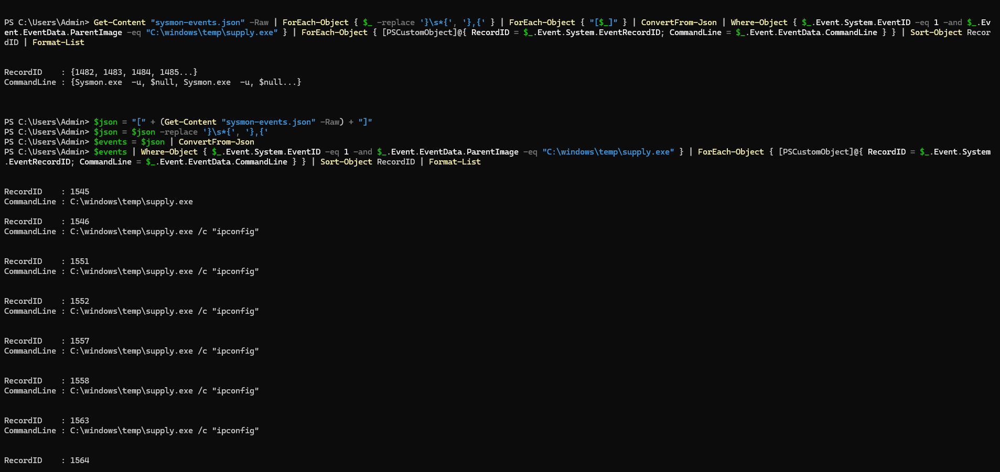

We can see the first command of the simultaneous commands is "ipconfig"

**Answer: ipconfig**

---

### 6. Looking at the dependency events around the malware, can you figure out the language the malware is written in? 

Since we know that we are dealing with dependencies here, we know that the Sysmon event would have an EventID of 7, sow e can change our powershell command:

```powershell
$raw = Get-Content "sysmon-events.json" -Raw
$json = "[" + ($raw -replace '}\s*{', '},{') + "]"
$events = $json | ConvertFrom-Json
$events | Where-Object { $_.Event.System.EventID -eq 7 -and $_.Event.EventData.Image -eq "C:\windows\temp\supply.exe" } | ForEach-Object { $_.Event.EventData } | Select-Object Image, ImageLoaded | Format-List
```

That outputted nothing - apparently there are no EventID 7 events. Let's try EventID 11 to see what types of files supply.exe creates:

```powershell
$raw = Get-Content "sysmon-events.json" -Raw
$json = "[" + ($raw -replace '}\s*{', '},{') + "]"
$events = $json | ConvertFrom-Json
$events | Where-Object { $_.Event.System.EventID -eq 11 -and $_.Event.EventData.Image -like "*supply*" } | ForEach-Object { $_.Event.EventData } | Select-Object Image, TargetFilename | Format-List
```

Running this we get the results:

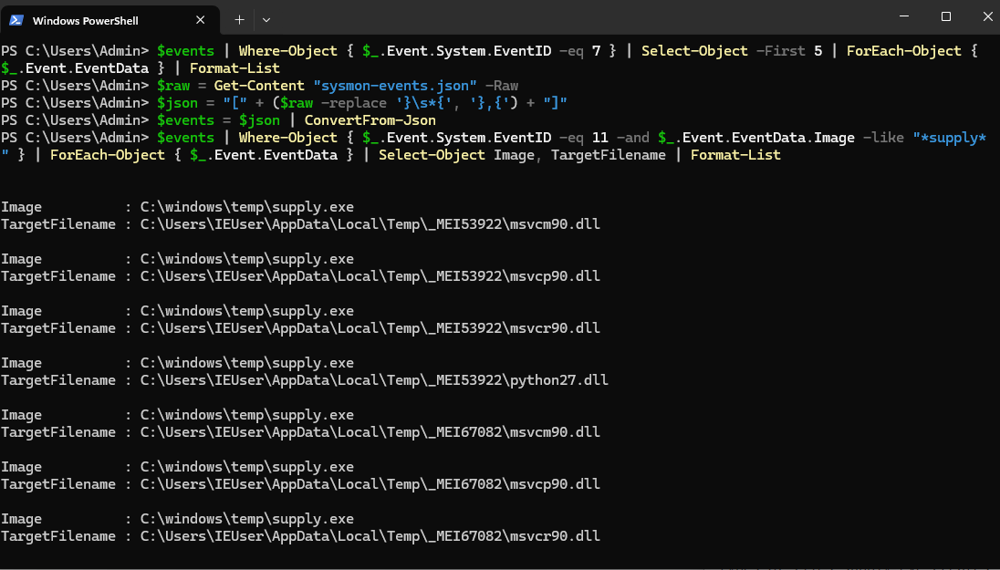

As we can see there are both C++ (msvcr, msvcp, msvcm) and python target files, but a quick lookup tells us that the consistent _MEI folder associated is a giveaway that PyInstaller is being used and extracting python scripts and dependencies to "MEI..." folders every time - so we know the malware is written in python.


**Answer: Python**

---

### 7. Malware then downloads a new file, find out the full url of the file download 

Similar to question #2, this requires the script to initiate a connection to download a file, but this time it might not be using the cmdlet used in #2 (INvoke-WebRequest), since we now know that supply.exe is a python script. Instead we should look for Sysmon EventID 3 for network connections: 

```powershell
$raw = Get-Content "sysmon-events.json" -Raw
$json = "[" + ($raw -replace '}\s*{', '},{') + "]"
$events = $json | ConvertFrom-Json
$events | Where-Object { $_.Event.System.EventID -eq 3 -and $_.Event.EventData.Image -like "*supply*" } | ForEach-Object { $_.Event.EventData } | Select-Object Image, DestinationIp, DestinationPort, DestinationHostname | Format-List
```

This will show us network connections where the image is supply.exe:

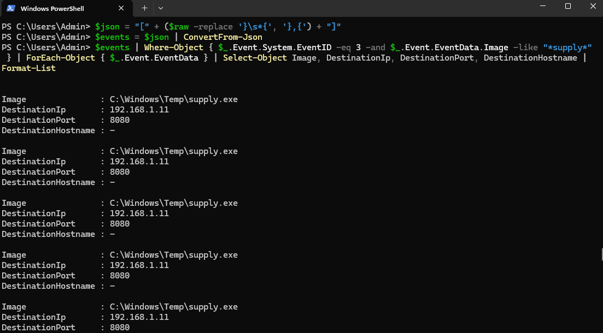

In this we see the results returned the port and IP address that the supply.exe image initiated a connection to, but we will need to cross reference these results with Event ID 11 (file creation) events following after. We will use Record IDs to do so: 

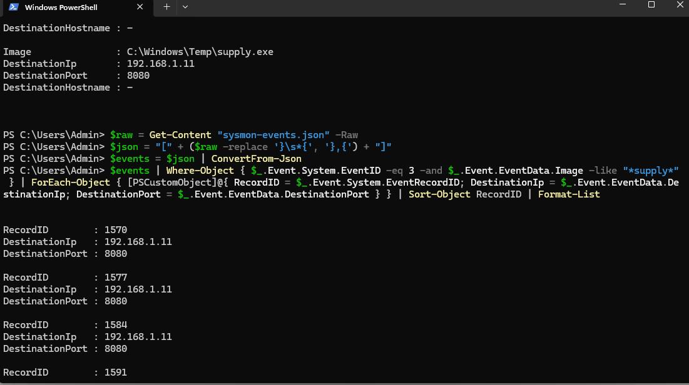

Here we see the first initiated connection has a recordID of 1570 and it spans well into the 2000s, and since we know from #7 that events with EventID 11 only shows targetfilenames of the PyInstaller dependencies, we will try EventID 1 to see if the url was hardcoded into a commandline execution: 

```powershell
$raw = Get-Content "sysmon-events.json" -Raw
$json = "[" + ($raw -replace '}\s*{', '},{') + "]"
$events = $json | ConvertFrom-Json
$events | Where-Object { $_.Event.System.EventID -eq 1 } | ForEach-Object { [PSCustomObject]@{ RecordID = $_.Event.System.EventRecordID; Image = $_.Event.EventData.Image; CommandLine = $_.Event.EventData.CommandLine } } | Sort-Object RecordID | Format-List
```

We see it here:

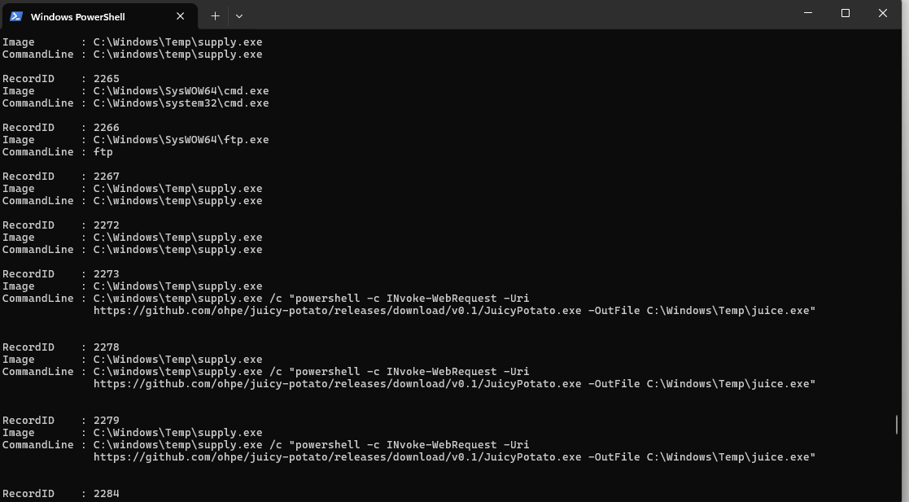

That the url is https://github.com/ohpe/juicy-potato/releases/download/v0.1/JuicyPotato.exe, and it turns out that the cmdlet INvoke-WebRequest is indeed used again - meaning the supply.exe python script called powershell to download the file instead of using its own libraries. 

**Answer: https://github.com/ohpe/juicy-potato/releases/download/v0.1/JuicyPotato.exe**

---

### 8. What is the port the attacker attempts to get reverse shell? 

For this we see after scrolling down just a few events:

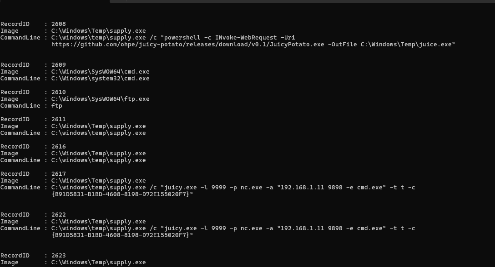

That juicypotato (privilege escalation tool) gained escalated privileges and launches nc.exe to connect to the the attacker's listening IP & port (9999) with a shell attached, and when the exploit succeeds, the attacker establishes the reverse shell on port 9898. 

**Answer: 9898**

---

**Completed:**

<br>

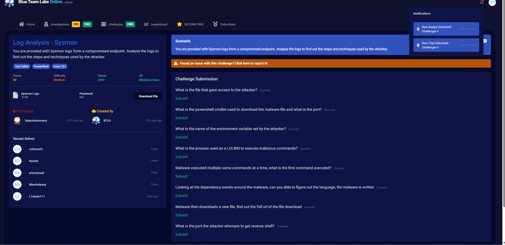
