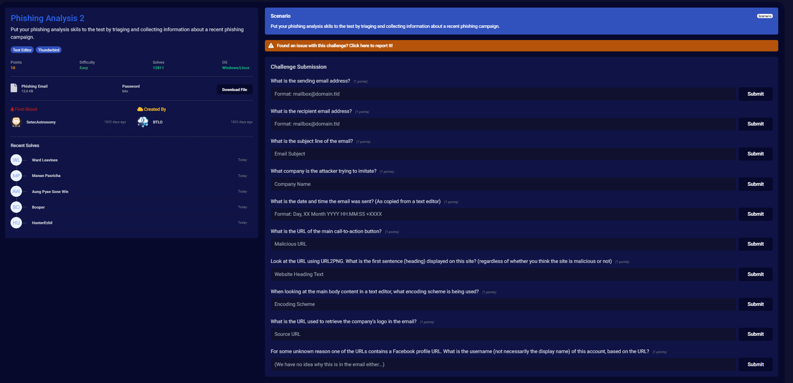
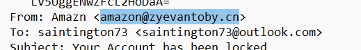
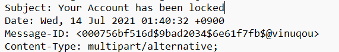
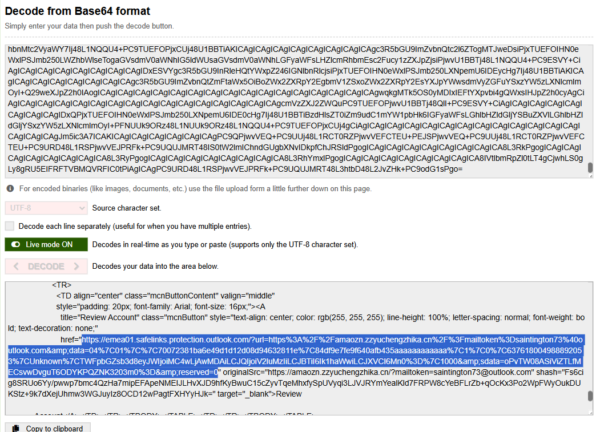
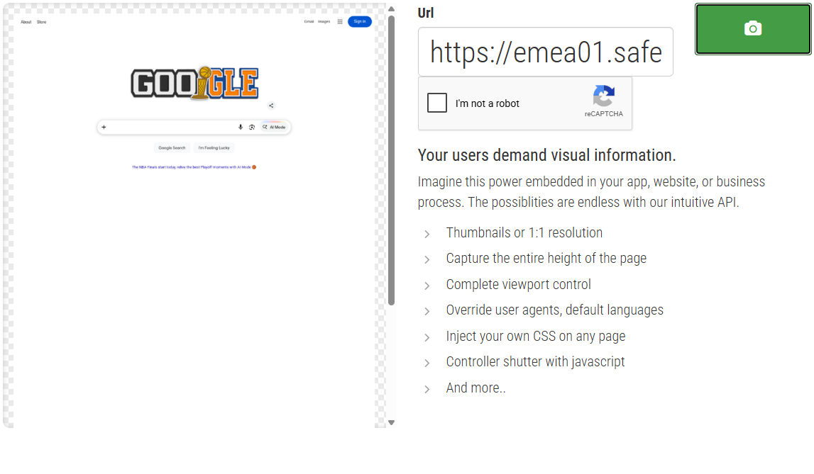
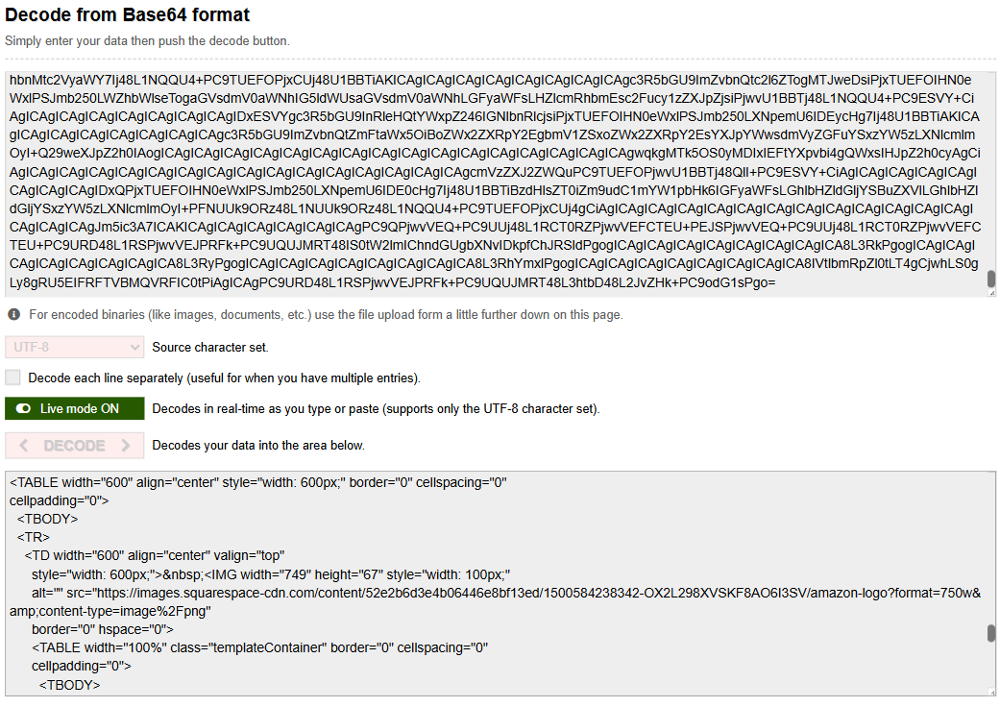
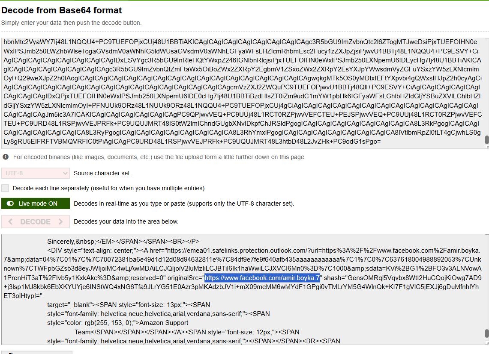
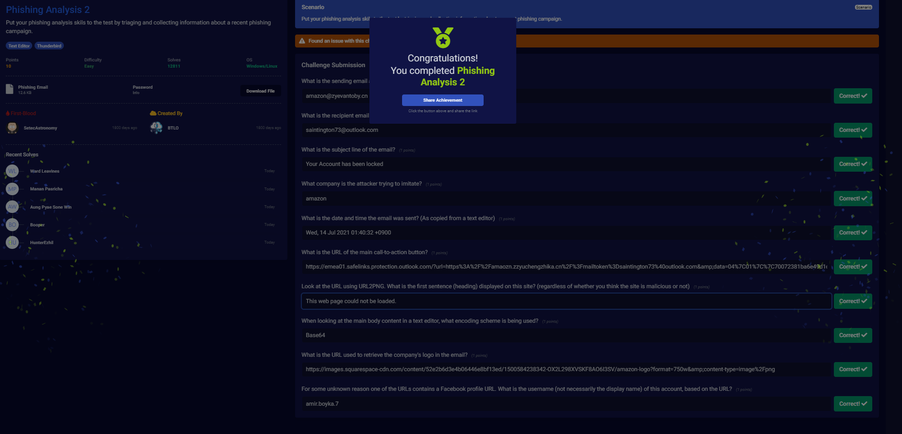

# Overview:
**We are provided with a phishing email (.eml file) and we need to analyze it to answer the prompt questions to ultimately identify the techniques and indicators used in this phishing campaign.**

 

**This challenge tasks us with analyzing a phishing email pretending to be from Amazon. We will simply use a text editor to examine the raw email headers, body, and embedded URLs.**

 

## Investigation:

### 1. What is the sending email address?

**Answer: amazon@zyevantoby.cn**

---

### 2. What is the recipient email address?

Shown in photo above

**Answer: saintington73@outlook.com**

---

### 3. What is the subject line of the email?

**Answer: Your Account has been locked**

---

### 4. What company is the attacker trying to imitate?
We can see with the sender address that he/she is trying to imitate amazon

**Answer: Amazon**

---

### 5. What is the date and time the email was sent? (As copied from a text editor)

Shown in photo above

**Answer: Wed, 14 Jul 2021 01:40:32 +0900**

---

### 6. What is the URL of the main call-to-action button?
For this I need to decod the base64 encoded string of the html of the actual email to see what the URL is:

We can see the "review account" button takes the victim to the link "https://emea01.safelinks.protection.outlook.com/?url=https%3A%2F%2Famaozn.zzyuchengzhika.cn%2F%3Fmailtoken%3Dsaintington73%40outlook.com&amp;data=04%7C01%7C%7C70072381ba6e49d1d12d08d94632811e%7C84df9e7fe9f640afb435aaaaaaaaaaaa%7C1%7C0%7C637618004988892053%7CUnknown%7CTWFpbGZsb3d8eyJWIjoiMC4wLjAwMDAiLCJQIjoiV2luMzIiLCJBTiI6Ik1haWwiLCJXVCI6Mn0%3D%7C1000&amp;sdata=oPvTW08ASiViZTLfMECsvwDvguT6ODYKPQZNK3203m0%3D&amp;reserved=0"

---

### 7. Look at the URL using URL2PNG. What is the first sentence (heading) displayed on this site?
For this one I went to URL2PNG.com and pasted the URL but it jsut returned a google page which wasn't correct, so I had to look up the answer which was "This web page could not be loaded."

**Answer: This web page could not be loaded.**

---

### 8. When looking at the main body content in a text editor, what encoding scheme is being used?
Base64, as we can see in question 6

**Answer: Base64**

---

### 9. What is the URL used to retrieve the company's logo in the email?

Also in the base64 html decoding: 

**Answer: https://images.squarespace-cdn.com/content/52e2b6d3e4b06446e8bf13ed/1500584238342-OX2L298XVSKF8AO6I3SV/amazon-logo?format=750w&amp;content-type=image%2Fpng**

---

### 10. For some unknown reason one of the URLs contains a Facebook profile URL. What is the username (not necessarily the display name) of this account, based on the URL?

Also in the base64 html decoding: 

**Answer: amir.boyka.7**

---

**Completed:**

