# Overview: 
**We are provided with Red Canary's 2022 threat report and tasked with analyzing it to answer questions that help build actionable intel for a newly established SOC.**

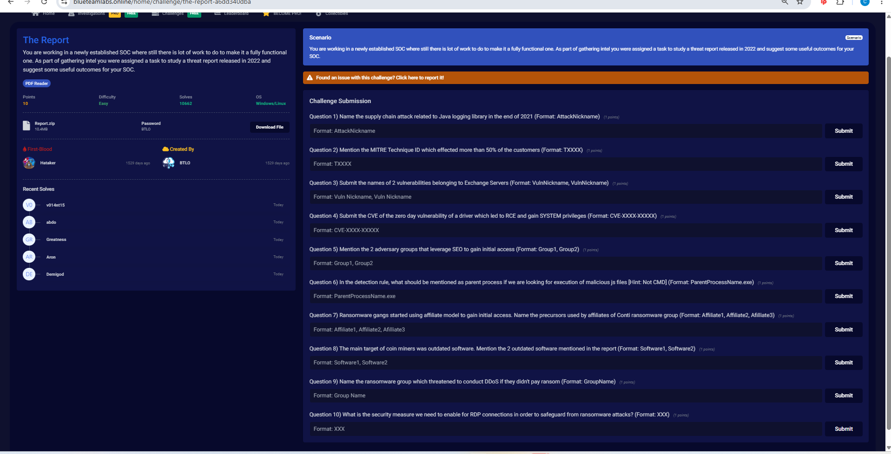

 

### Methodology: 
**This challenge is unique because rather than hands-on log analysis or forensics, it requires reading and learning a real-world threat report from a major MSP/MDR including specific techniques, CVEs, adversary groups, and detection insights that are directly tied to SOC operations.**

 

## Investigation:

### 1. Name the supply chain attack related to Java logging library in the end of 2021.
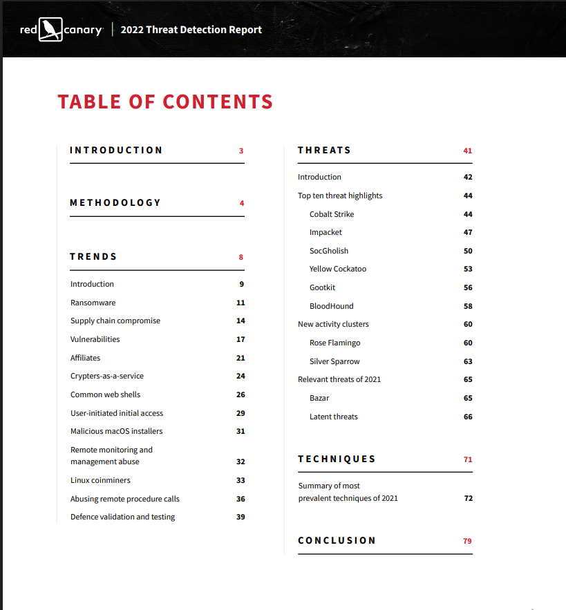

We can see in the table of contents that page 14 is where the supply chain compromise is located, so we will go there:

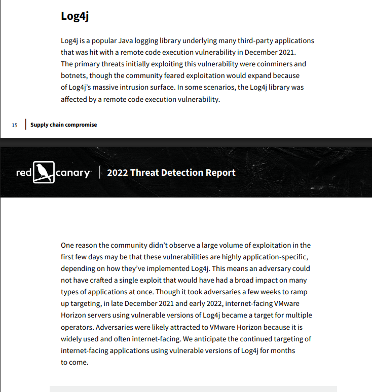

We see the supply chain attack at the end of 2021 (December) was called Log4j which was a java logging library for third party apps that was compromised to allow remote code execution.

**Answer: Log4j**

---

### 2. Mention the MITRE Technique ID which effected more than 50% of the customers. 
In the table of contents we see techniques is on page 71, so we will scroll to that:

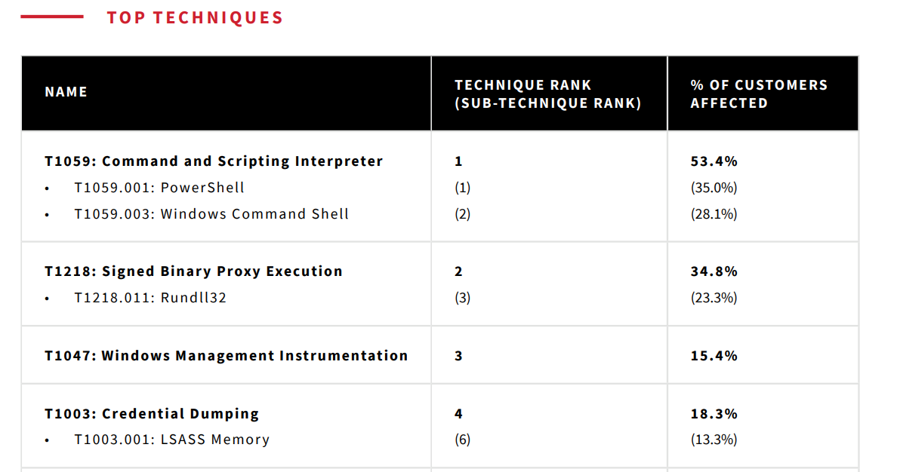

We see the technique that affected more than 50% of customers (53.1%) was T1059: Command Scripting Interpreter, and it was split into powershell (35%) and command line (28.1%). This gives us a good idea of how dangerous command line scripting can be in compromising systems. 

**Answer: T1059**

---

### 3. Submit the names of 2 vulnerabilities belonging to Exchange Servers.
We see vulnerabilities on page 17 on the TOC:

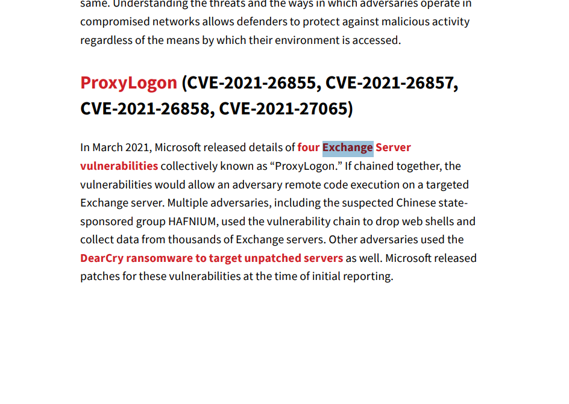

and going to that we see there is 1 vuln called ProxyLogon that belonged to exhange servers, which was actually 4 vulns chained together that ultimately led to remote access and execution on an exchange server. Adversaries dropped web shells to exfiltrate data from thousands of exchange servers.

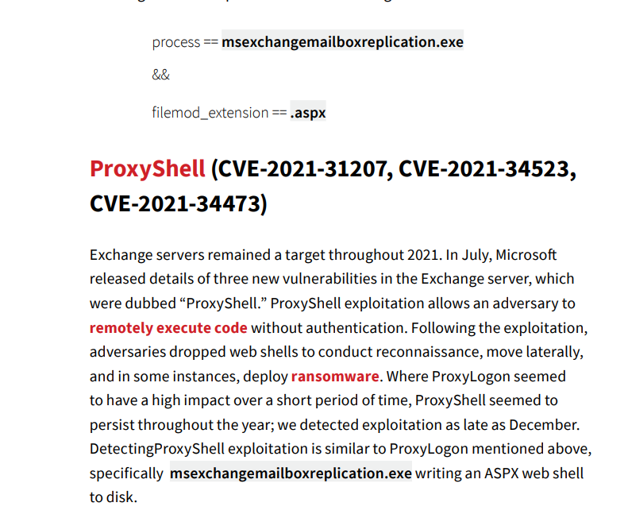

The next is ProxyShell, which very similarly allowed attackers to execute remote code without auth leading to system and network compromise

**Answer: ProxyLogon, ProxyShell**

---

### 4. Submit the CVE of the zero day vulnerability of a driver which led to RCE and gain SYSTEM privileges.
Scrolling down we see PrintNightmare: 
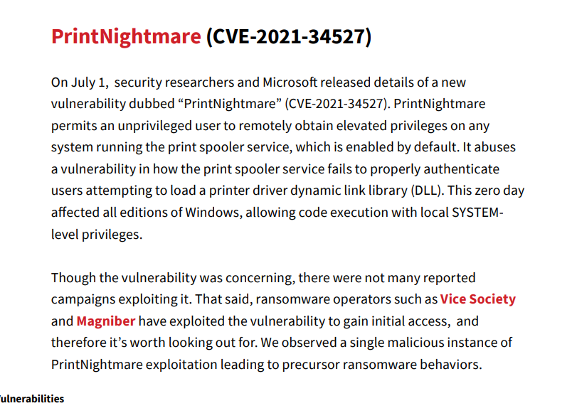

Which was a zero day that allowed remote users to gain elevated access using the printspooler (users loading print driver DLLs).

**Answer: CVE-2021-34527**

---

### 5. Mention the 2 adversary groups that leverage SEO to gain initial access.
For this one I just used ctrl F to find the SEO mentioned, and we see:

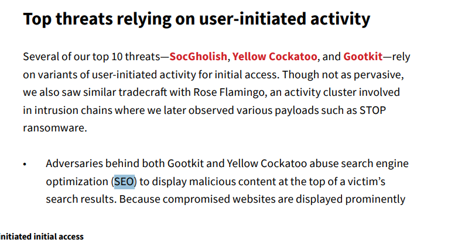

That Gootkit and Yellow cockatoo were the 2 adversary groups that leveraged SEO (with high-intent keywords) to gain initial access.

**Answer: Gootkit, Yellow Cockatoo**

---

### 6. In the detection rule, what should be mentioned as parent process if we are looking for execution of malicious js files.

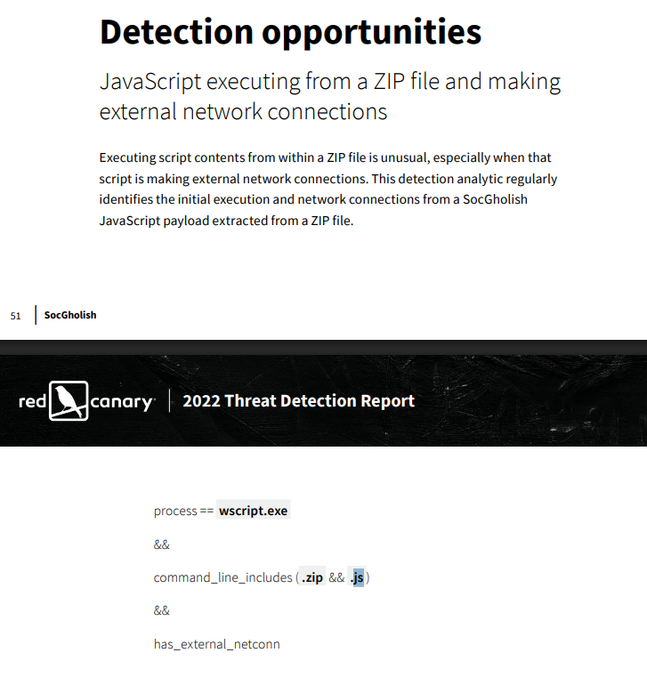

in the detection rule, if a .js file executes from a wscript.exe parentprocess it should be flagged - as wscript.exe allows for .js files to run system commands allowing for malware/compromise.

**Answer: wscript.exe**

---

### 7.  Ransomware gangs started using affiliate model to gain initial access. Name the precursors used by affiliates of Conti ransomware group.
Using Ctrl F to find Conti:

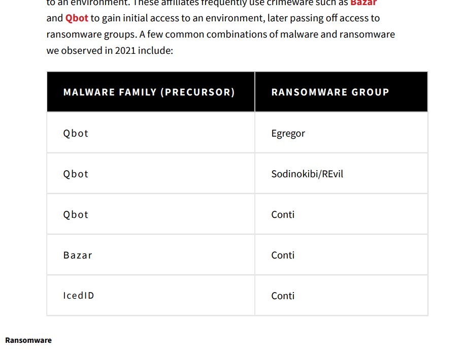

We see that the 3 precursors to the Conti ransomware group are QBot, Bazar, and IcedID.

**Answer: QBot, Bazar, IcedID**

---

### 8. The main target of coin miners was outdated software. Mention the 2 outdated software mentioned in the report.
We see in the TOC of coin miners is on page 33:

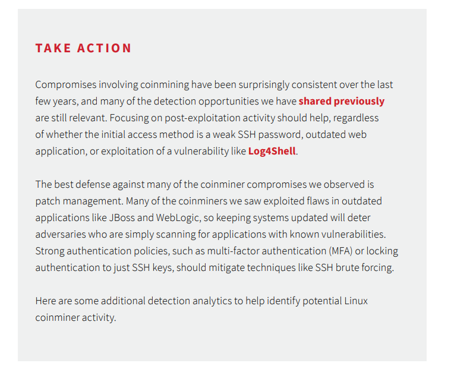

And we see here that 2 of the mentioned outdated software targets of coin miners were JBoss and WebLogic - these showed why patch management is so important.

**Answer: JBoss, WebLogic**

---

### 9. Name the ransomware group which threatened to conduct DDoS if they didn't pay ransom
We see in the TOC that ransomware starts on page 11:

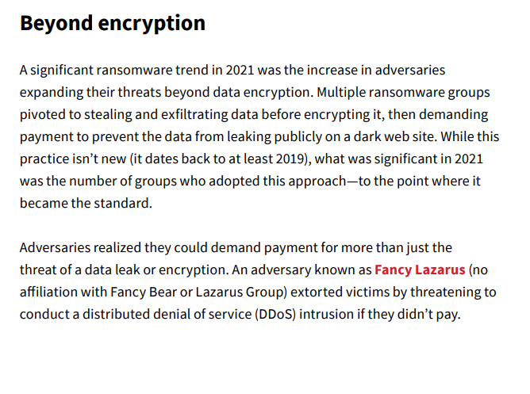

We see the group that threatened to conduct DDoS if they didn't pay ransom was Fancy Lazarus.

**Answer: Fancy Lazarus**

---

### 10.  What is the security measure we need to enable for RDP connections in order to safeguard from ransomware attacks? 
Scrolling down in ransomware a bit:

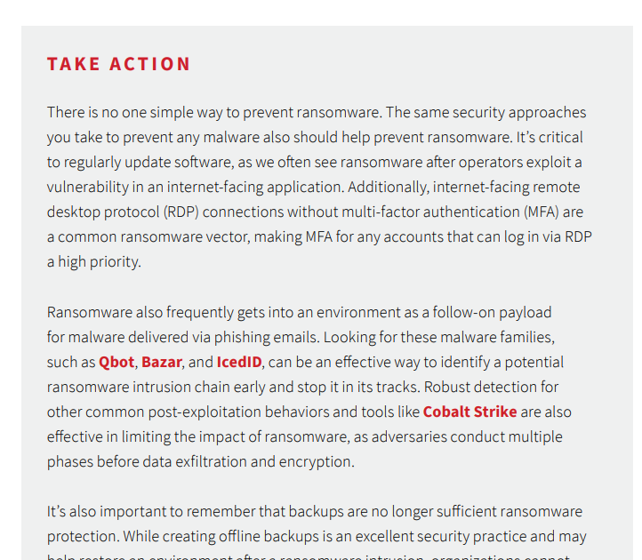

The answer is MFA or multifactor auth so that we can confirm the people who are logging on to RDP are actually who they say they are.

**Answer: MFA**

---

**Completed:**

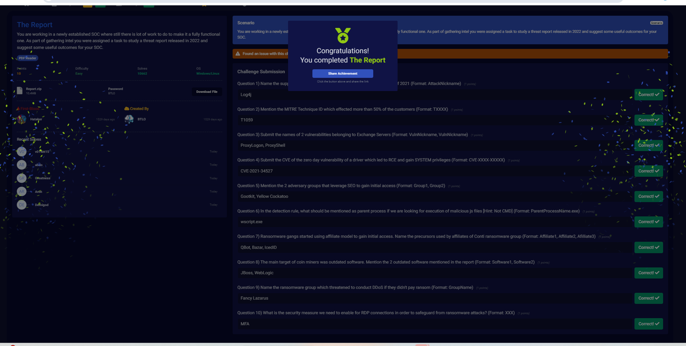
